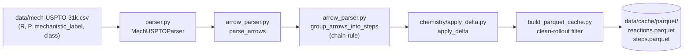
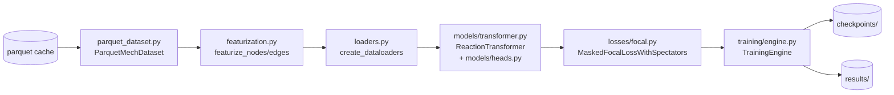
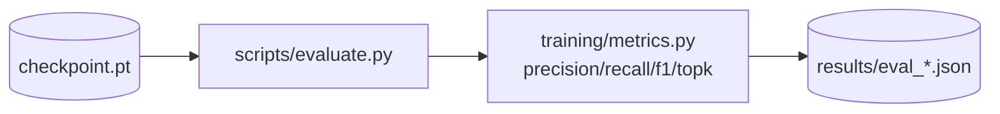
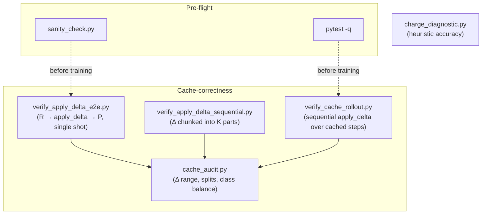

# Architecture

End-to-end data and module flow. Companion to [docs/glossary.md](glossary.md) and [docs/repo-map.md](repo-map.md).

## Data pipeline

## Training loop

## Inference / evaluation

## Verification harness

## Module map

| Package | Responsibility |
|---|---|
| `mech_uspto.constants` | Atom/bond enumerations and shared constants. |
| `mech_uspto.data` | CSV parsing, arrow → step grouping, featurization, dataset, dataloader, parquet cache I/O, spectator detection, Δ matrix transformations. |
| `mech_uspto.chemistry` | `apply_delta` (bond surgery on RDKit Mol) and the valence/VTS counter. |
| `mech_uspto.models` | Graph transformer body + prediction heads. |
| `mech_uspto.losses` | Focal loss with spectator masking. |
| `mech_uspto.training` | Engine (train/val loop), config, metrics, run tracking. |

Per-symbol detail: regenerate [docs/repo-map.md](repo-map.md) with `python scripts/gen_repo_map.py`.
